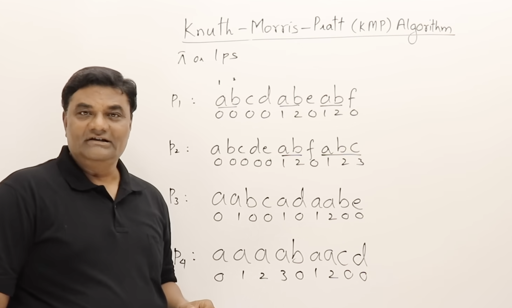
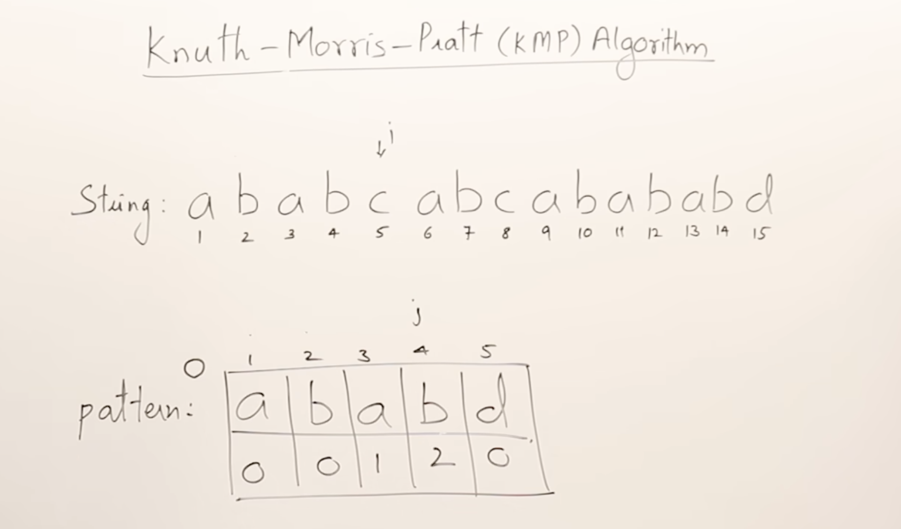

# DSA Preparation

## Algorithms

---

### String Matching Algorithms

#### KMP Algorithm

The Knuth-Morris-Pratt (KMP) algorithm is an efficient string matching algorithm that searches for occurrences of a "pattern" string within a "text" string. It achieves this by preprocessing the pattern to create a longest prefix-suffix (LPS) array, which allows it to skip unnecessary comparisons when a mismatch occurs.

- Time complexity: O(n + m), where n is the length of the text and m is the length of the pattern.
- Space complexity: O(m) for the LPS array.
- Video: [KMP Algorithm Explained](https://youtu.be/V5-7GzOfADQ)


**General Idea:**

- Prefix: Any subset of the pattern that starts from the beginning index.
- Suffix: Any subset of the pattern that ends at the last index.
- Core Idea: The KMP algorithm observes whether the beginning part of a pattern (a prefix) appears again later in the pattern (as a suffix), which helps determine where to shift the search when a mismatch occurs.

- The PI (or LPS) Table:  
    The LPS (Longest Prefix which is also a Suffix) table is essential for the algorithm. It stores the length of the longest proper prefix that is also a suffix for every sub-pattern.  
    By creating this table, the algorithm gains a "memory" of the pattern, allowing it to skip redundant comparisons.

- How it works:
    1. Preprocessing: Build the LPS table for the pattern.
    2. Matching: Maintain two pointers: one for the string (I) and one for the pattern (J).
    3. Efficient Shifting: When a mismatch occurs, instead of backtracking the main string pointer (I), the algorithm uses the LPS table to shift only the pattern pointer (J). This ensures that the pointer I always moves forward, never backward.
    4. Outcome: The algorithm efficiently traverses the string only once, significantly reducing the search time compared to the naive O(MN) method.

**Relevant Imges:**

1. LPS Table Construction:


2. Utilization of LPS Table:



**Problem Agnostic Solution:**
```python
class KMP:
    def build_lps(self, pattern: str):
        lps = [0] * len(pattern)
        length = 0
        i = 1
        
        while i < len(pattern):
            if pattern[i] == pattern[length]:
                length += 1
                lps[i] = length
                i += 1
            else:
                if length != 0:
                    length = lps[length - 1]
                else:
                    lps[i] = 0
                    i += 1
        
        return lps

    def search(self, text: str, pattern: str):
        lps = self.build_lps(pattern)
        
        i = j = 0
        
        while i < len(text):
            if text[i] == pattern[j]:
                i += 1
                j += 1
                
                if j == len(pattern):
                    return True
            else:
                if j != 0:
                    j = lps[j - 1]
                else:
                    i += 1
        
        return False
```

