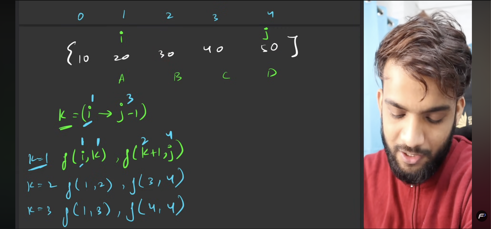
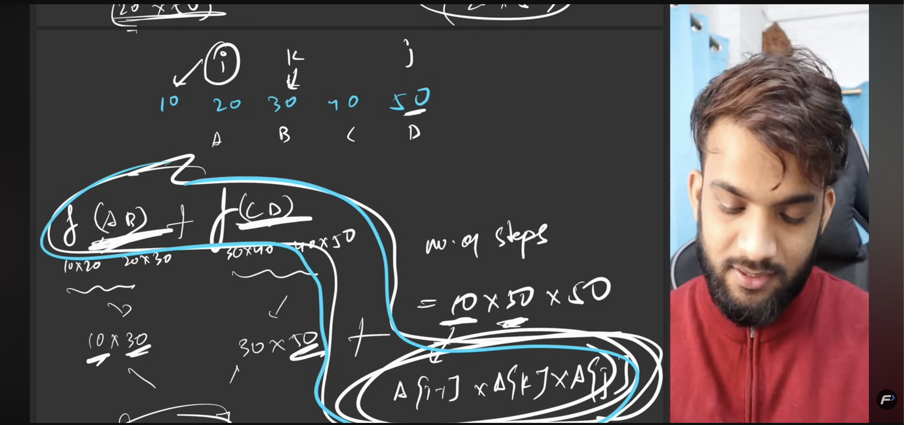

### Matrix Chain Muliplication
The Matrix Chain Multiplication problem is a classic optimization problem that involves finding the most efficient way to multiply a given sequence of matrices. The goal is to determine the optimal order of matrix multiplications that minimizes the total number of scalar multiplications required.
This is classical problem of `Partition DP` and can be solved using `Dynamic Programming`.

- **Time Complexity:** O(n^3), where n is the number of matrices.
- **Space Complexity:** O(n^2) for the DP table.
- **Video:** [Matrix Chain Multiplication Explained](https://www.youtube.com/watch?v=prx1psByp7U), [Striver's MCM Video](https://www.youtube.com/watch?v=vRVfmbCFW7Y)

**General Idea:**
1. Define a DP table `dp[i][j]` to store the minimum number of scalar multiplications needed to compute the matrix chain from matrix `i` to matrix `j`.
2. Initialize the diagonal of the table with zeros, as multiplying a single matrix requires no multiplications.
3. Fill the table using a bottom-up approach, considering all possible positions to split the product.
4. The final answer will be stored in `dp[1][n]`, where `n` is the number of matrices.

#### Formula:
The recursive formula for the DP table is:
M[i][j] = min(M[i][k] + M[k+1][j] + p[i-1]*p[k]*p[j]) for all i <= k < j

Where:
- k is the index where we split the product of matrices from i to j.
- M[i][j] is the minimum number of multiplications needed to multiply matrices from i to j.
- p[i-1], p[k], and p[j] are the dimensions of the matrices involved in the multiplication.

```python
# Example usage:
p = [10, 20, 30, 40, 30]  

# say A1 is 10x20, A2 is 20x30, A3 is 30x40, A4 is 40x30

1. Initialize the DP table:
   [
    [0,   0,   0,   0,   0],
    [0,   0, inf, inf, inf],
    [0, inf,   0, inf, inf],
    [0, inf, inf,   0, inf],
    [0, inf, inf, inf,   0]
   ]

2. Fill the DP table:
    - For length = 2:
        - i = 1, j = 2: dp[1][2] = min(dp[1][1] + dp[2][2] + p[0]*p[1]*p[2]) = 6000
        - i = 2, j = 3: dp[2][3] = min(dp[2][2] + dp[3][3] + p[1]*p[2]*p[3]) = 24000
        - i = 3, j = 4: dp[3][4] = min(dp[3][3] + dp[4][4] + p[2]*p[3]*p[4]) = 36000
    - For length = 3:
        - i = 1, j = 3: dp[1][3] = min(dp[1][1] + dp[2][3] + p[0]*p[1]*p[3], dp[1][2] + dp[3][3] + p[0]*p[2]*p[3]) = 18000
        - i = 2, j = 4: dp[2][4] = min(dp[2][2] + dp[3][4] + p[1]*p[2]*p[4], dp[2][3] + dp[4][4] + p[1]*p[3]*p[4]) = 30000
    - For length = 4:
        - i = 1, j = 4: dp[1][4] = min(dp[1][1] + dp[2][4] + p[0]*p[1]*p[4], dp[1][2] + dp[3][4] + p[0]*p[2]*p[4], dp[1][3] + dp[4][4] + p[0]*p[3]*p[4]) = 30000

   [
    [0,   0,   0,      0,     0],
    [0,   0, 6000, 18000, 30000],
    [0, inf,    0, 24000, 30000],
    [0, inf,  inf,     0, 36000],
    [0, inf,  inf,   inf,     0]
   ]

# Partition Matrix:
# This matrix shows the split points for optimal multiplication:
eg: P[1][4] = 2 means the optimal split for multiplying matrices A1 to A4 is between A2 and A3 because it minimizes the total number of scalar multiplications.
we know that, 
For i = 1, j = 4: dp[1][4] = MIN[(A1 x A2) x (A3 x A4), (A1 x (A2 x A3)) x A4, (A1 x (A2 x A3 x A4))] => (A1 x A2) x (A3 x A4) => P[1][4] = 2 (`means we split between A2 and A3`)
=> min(dp[1][1] + dp[2][4] + p[0]*p[1]*p[4], dp[1][2] + dp[3][4] + p[0]*p[2]*p[4], dp[1][3] + dp[4][4] + p[0]*p[3]*p[4]) = 30000

[
 [0, 0, 1, 2, 3],
 [0, 0, 0, 2, 3],
 [0, 0, 0, 0, 3],
 [0, 0, 0, 0, 0],
 [0, 0, 0, 0, 0]
]
```

**Problem Agnostic Solution:**
```python
class Solution:
    def matrixMultiplication(self, arr):
        n = len(arr)
        dp = [[0] * n for _ in range(n)]
        partition = [[0] * n for _ in range(n)]

        for i in range(n - 1, 0, -1):
            for j in range(i + 1, n):
                dp[i][j] = float('inf')

                for k in range(i, j):
                    cost = (
                        dp[i][k]
                        + dp[k + 1][j]
                        + arr[i - 1] * arr[k] * arr[j]
                    )

                    if cost < dp[i][j]:
                        dp[i][j] = cost
                        partition[i][j] = k

        return dp[1][n - 1], partition

```

If you also want to print the optimal parenthesization:

```python
class Solution:
    def matrixMultiplication(self, arr):
        n = len(arr)
        dp = [[0] * n for _ in range(n)]
        partition = [[0] * n for _ in range(n)]

        for i in range(n - 1, 0, -1):
            for j in range(i + 1, n):
                dp[i][j] = float('inf')

                for k in range(i, j):
                    cost = (
                        dp[i][k]
                        + dp[k + 1][j]
                        + arr[i - 1] * arr[k] * arr[j]
                    )

                    if cost < dp[i][j]:
                        dp[i][j] = cost
                        partition[i][j] = k

        return dp[1][n - 1], partition, self._build_order(1, n - 1, partition)

    def _build_order(self, i, j, partition):
        if i == j:
            return f"A{i}"

        k = partition[i][j]
        left = self._build_order(i, k, partition)
        right = self._build_order(k + 1, j, partition)
        return f"({left} x {right})"
```

### Relevant Images:

explains the 2 recursive calls and how the partitioning works in the matrix chain multiplication problem.


no of scalar multiplications required for different parenthesizations of the matrix chain multiplication problem.
Also why A[i-1] * A[k] * A[j] is used in the formula for calculating the cost of multiplying matrices from i to j with a split at k.



#### qn:
1) why does i goes from [n-1 -> 1] and j goes from [i+1 -> n] in the DP table filling loop?
In the dynamic programming solution for the Matrix Chain Multiplication problem, the loops for filling the DP table are structured in a specific way to ensure that all necessary subproblems are solved before they are needed. Specifically:

- The outer loop for `i` goes from `n-1` to `1` because we need to solve smaller subproblems first. `i` represents the starting index of the subproblem, and by iterating backwards, we ensure that when calculating `dp[i][j]`, all `dp[i][k]` for `k > i` are already computed.
- The inner loop for `j` goes from `i+1` to `n` because `j` represents the ending index of the subproblem. This ensures that we only consider valid subproblems where the start index is less than the end index.

